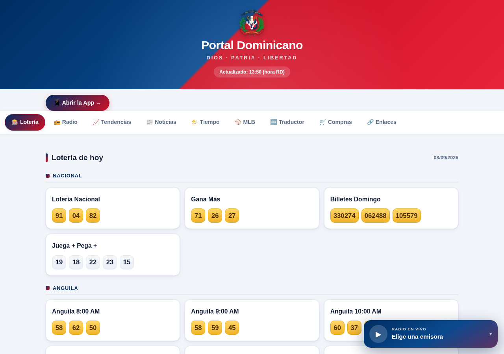

# 🇩🇴 Portal Dominicano

**Todo lo que buscas de República Dominicana, en un solo lugar.** Resultados de lotería en vivo, radio FM dominicana, noticias, clima, MLB, traductor y tiendas en línea — gratis y sin registrarse.



[](https://benzanmontage-hue.github.io/portal-dominicano/)
[](https://benzanmontage-hue.github.io/portal-dominicano/app.html)
[](LICENSE)

## ✨ Qué incluye

| Sección | Descripción |
|---|---|
| 🎰 **Lotería de hoy** | Resultados en vivo de 7 loterías (Nacional, Anguila, Real, Loteka, La Primera, La Suerte, Leidsa) — 52 juegos |
| 📻 **Radio FM** | 40 emisoras dominicanas reproducibles en el navegador |
| 📰 **Noticias** | Titulares de República Dominicana en español, actualizados |
| 📈 **Tendencias** | Lo más buscado en Google en RD, en tiempo real |
| 🌤️ **Tiempo** | Clima por ciudad (Santo Domingo, Santiago, Punta Cana…) |
| ⚾ **MLB** | Marcadores del día |
| 🔤 **Traductor** | Español ↔ Inglés |
| 🛒 **Compras** | Amazon, Temu, Shein, AliExpress, Mercado Libre, Corotos… |

## 🚀 Características

- **PWA instalable** — se instala como app en el teléfono (Android + iOS)
- **Widget flotante** de radio con noticias deslizantes
- **Móvil primero**, identidad dominicana (bandera, escudo, "Dios · Patria · Libertad")
- **100% gratis** — sin API keys, sin registro
- **Datos en vivo** — se actualiza automáticamente cada 3 horas

## 🛠️ Cómo funciona

Es una web estática (HTML + CSS + JS vanilla, sin frameworks) alojada en GitHub Pages. Los datos se descargan con scripts en Python desde fuentes públicas y se guardan como JSON:

| Script | Fuente | Datos |
|---|---|---|
| `scripts/scrape_loteria.py` | loteriasdominicanas.com API | Resultados de lotería |
| `scripts/scrape_radio.py` | radio-browser.info | Emisoras FM |
| `scripts/scrape_noticias.py` | Google News RSS | Noticias RD |
| `scripts/scrape_tendencias.py` | Google Trends RSS | Tendencias de búsqueda |

Un cron actualiza los datos y hace push cada 3 horas (8 veces al día).

## ⚙️ Despliegue

```bash
# Clonar
git clone https://github.com/benzanmontage-hue/portal-dominicano.git
cd portal-dominicano

# Regenerar datos
python3 scripts/scrape_loteria.py
python3 scripts/scrape_radio.py
python3 scripts/scrape_noticias.py
python3 scripts/scrape_tendencias.py

# Servir localmente
python3 -m http.server 8000
```

## ⚠️ Aviso

Portal **informativo**. No vendemos sorteos ni loterías. Verifica siempre los resultados con la fuente oficial.

## 📄 Licencia

MIT — código abierto. Los datos provienen de fuentes públicas con sus propios términos.

---

*Dios · Patria · Libertad* 🇩🇴
